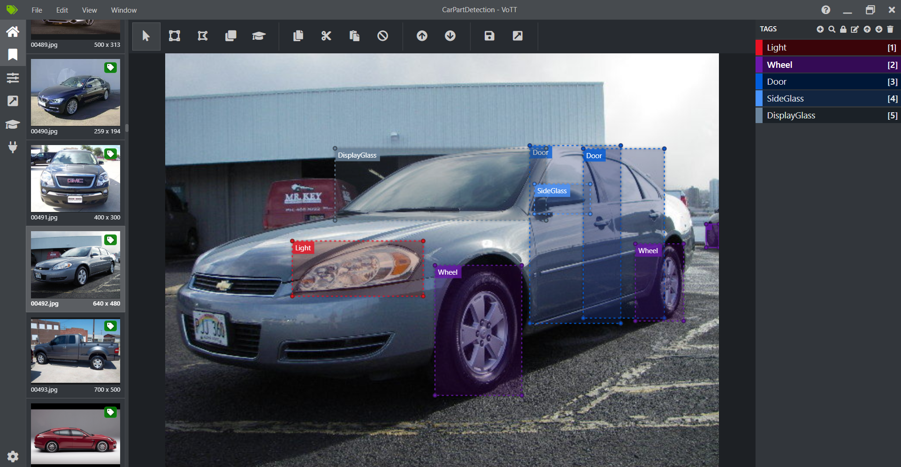
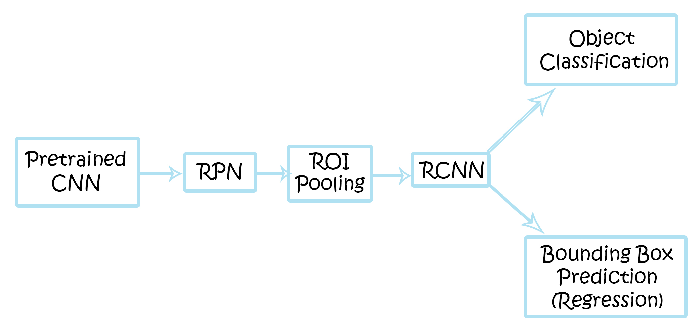

# Car Parts Detection Using Fatser RCNN for Custom Dataset:
This project has three steps: 
1. Create Custom Dataset
2. [Training RPN and RCNN Network](FRCNNCarPartDetectionTrain.ipynb)
3. [Detect Object](FRCNNCarPartDetectionTest.ipynb)

## How to create your own custom dataset for Object Detection: 
I have come across three tools so far, which can help us to label images for object detection,
- [Microsoft Visual Object Tagging Tool](https://github.com/microsoft/VoTT)
- [LabelMe](http://labelme.csail.mit.edu/Release3.0/)
- [VGG Image Annotator](http://www.robots.ox.ac.uk/~vgg/software/via/)

For this Project, i used Microsoft VoTT. I have Created 500 labeled images having five classes:
1. Display Glass
2. Side Glass
3. Wheel
4. Door
5. Light

When you complete the Dataset Labeling part in Microsoft VoTT in Export Setting you have to choose export as *CSV file*.

## Faster RCNN Architecture Overview: 

Here are the few articles which can develop Understanding regarding Faster RCNN: 
- [faster-r-cnn-down-the-rabbit-hole-of-modern-object-detection](https://tryolabs.com/blog/2018/01/18/faster-r-cnn-down-the-rabbit-hole-of-modern-object-detection/)
- [review-of-deep-learning-algorithms-for-object-detection](https://medium.com/zylapp/review-of-deep-learning-algorithms-for-object-detection-c1f3d437b852)
- [deep-learning-for-object-detection-a-comprehensive-review](https://towardsdatascience.com/deep-learning-for-object-detection-a-comprehensive-review-73930816d8d9)
- [faster-r-cnn-object-detection-implemented-by-keras-for-custom-data-from-googles-open-images](https://towardsdatascience.com/faster-r-cnn-object-detection-implemented-by-keras-for-custom-data-from-googles-open-images-125f62b9141a)
- [object-detection-an-overview-in-the-age-of-deep-learning](https://tryolabs.com/blog/2017/08/30/object-detection-an-overview-in-the-age-of-deep-learning/)
